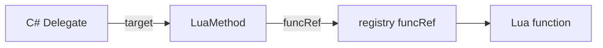

# NovaLua 函数 / Delegate Marshal 规范

本文档描述 **C# `Delegate` 与 Lua 函数** 之间的双向编组，适用于 **Il2Cpp（Player）** 与 **Mono（Editor）**。

**相关文档：**

| 文档 | 内容 |
|------|------|
| `MARSHAL_SPEC.md` | 参数编组总览 |
| `CLASS_MARSHAL_SPEC.md` | 引用类型 userdata、`ObjectRegistry` |
| `TYPE_SYSTEM_SPEC.md` | 委托类型表、`__call` |
| `LIB_SPEC.md` | `novalua` 标准库（可选 `to_delegate`） |
| `IL2CPP_DESIGN_SPEC.md` | `LuaInvokeRuntime`、`MethodBridge`、Codegen |
| `STRUCT_MARSHAL_SPEC.md` | `[LuaMarshalAs]` 与非默认 marshal |

**平台原则：** Mono 与 Il2Cpp 的 **Lua 可见语义一致**；Il2Cpp 使用 closed delegate + C++ bridge；Mono 可用等价 C# shim，不走不同的调用契约。

---

## 1. 问题与目标

| 方向 | 需求 |
|------|------|
| **C# delegate → Lua** | 当作托管对象传入 Lua；可 `Invoke` / 像函数一样调用 |
| **Lua function → C# delegate** | Lua 调用带 delegate 形参的 C# 方法时，**隐式**将 Lua function marshal 为对应类型 delegate |

| 目标 | 说明 |
|------|------|
| 无感 | 与普通参数一样：Lua 传 function，由 **方法调用的 marshal 层** 完成转换，脚本无需 `to_delegate` |
| 性能 | Player 侧零反射；按 **Invoke 签名** 复用 bridge（同 `MethodBridge`） |
| 统一 | 与 `[LuaInvoke]` 共用 `PushDefault` / `PopDefault` / `LuaPCall`；delegate 形参走 `ReadValue` / `ComposeFromStack` 同一套规则 |
| 安全 | `funcRef` 生命周期与 delegate 绑定；禁止悬空调用 |
| 可控 | 未 codegen 的 delegate 签名在运行时明确报错 |

---

## 2. 总体架构

```mermaid
flowchart TB
    subgraph CSharpToLua["C# delegate → Lua"]
        D1[Il2CppMulticastDelegate*]
        UD1[userdata + IMT.__call]
        D1 --> UD1
        UD1 -->|__call / Invoke| INV[delegate.invoke_impl]
    end

    subgraph LuaToCSharp["Lua function → C# delegate（主路径：隐式 marshal）"]
        CALL[obj:Method(..., luaFn, ...)]
        MB[MethodBridge ReadValue / ComposeFromStack]
        LF[Lua function 实参]
        REF[luaL_ref → funcRef]
        LM[LuaMethod target]
        BR[DelegateBridge 按形参 delegate 类型]
        DEL[临时或持久的 C# Delegate]
        LF --> CALL
        CALL --> MB
        MB --> REF
        REF --> LM
        LM --> DEL
        BR -->|SetClosedDelegateInvoke| DEL
        DEL -->|C# 回调| BR
        BR -->|pcall funcRef| LF
    end
```

**核心组件：**

| 组件 | 职责 |
|------|------|
| `LuaMethod` | 托管 target 对象，持有 `funcRef`（registry ref） |
| `DelegateBridges` | 按 delegate `Invoke` 签名生成的 C++（Player）/ C# shim（Editor）桥 |
| `LuaDelegateBinder` | 创建 delegate：`LuaMethod` + bridge + `SetClosedDelegateInvoke`；由 **参数 marshal** 调用 |
| `Marshaling::ReadDelegate` | 栈上 Lua function → delegate；与 `ReadValue` 并列，供方法调用路径使用 |
| `LuaCallContext` | 抽象 `{ funcRef }`，供 Delegate bridge 与 `[LuaInvoke]` 共用 marshal 路径 |

---

## 3. C# delegate → Lua

### 3.1 承载形态

- delegate 实例为 **普通托管对象 userdata**（`ObjectRegistry` 跟踪，`Il2CppMulticastDelegate*` / GCHandle）。
- 类型表与普通 class 相同；静态成员走类型表，实例走 `IMT`。

### 3.2 Lua 调用方式

| 写法 | 说明 |
|------|------|
| `d:Invoke(a, b)` | 显式调用 `Invoke` |
| `d.Invoke(d, a, b)` | 点号 + 显式 self（若暴露为实例方法） |
| `d(a, b)` | **`IMT.__call`** → 转发到 `Invoke` |

```lua
local handler = someObj.Handler   -- C# event / 字段返回的 delegate
handler(42)                         -- __call
handler:Invoke(42)
```

### 3.3 语义

| 项 | 规则 |
|----|------|
| **Multicast** | `Invoke` / `__call` 保持 C# 多播语义（调用整条链） |
| **null** | C# `null` → Lua `nil`；对 `nil` 调用报错 |
| **开放 delegate** | `target == null` 的 open delegate：MVP 可不支持或单独扩展 |
| **方向** | C# → Lua **不**进入 Lua VM（直接 `invoke_impl`），除非 delegate 本身绑定到 Lua 回调 |

### 3.4 实现要点（Il2Cpp）

- `__call` 与 `Invoke` 共用同一 bridge：经 `MethodBridge` 调用 delegate 的 `invoke_impl`。
- 无需为「仅 C#→Lua 传递」单独生成 Lua 回调。

---

## 4. Lua function → C# delegate

### 4.0 主路径：方法参数隐式 marshal（默认）

**一般不需要**在 Lua 里显式创建 delegate。当 Lua 调用 C# 方法，且某形参类型为 delegate（如 `Action`、`Func<>`、自定义 delegate）时，与其它类型参数一样，由 **方法调用的 marshal 层** 在入参阶段完成转换。

```lua
-- C#: void RegisterCallback(Action<int> onValue)
obj:RegisterCallback(function(v) print(v) end)
```

流程：

```
1. MethodBridge 按 MethodInfo 解析第 N 个形参类型为 delegateClass
2. 栈上该位置为 Lua function（或 nil → null delegate）
3. Marshaling::ReadDelegate(L, index, delegateClass)
     → luaL_ref 得到 funcRef
     → LuaDelegateBinder::Create(delegateClass, funcRef)
4. 将生成的 Il2CppDelegate* 填入 C# 调用参数
5. C# 方法返回后：若 delegate 未被 C# 侧长期持有，随本次调用结束可回收 LuaMethod 并 unref；
   若被 C# 字段/事件持有，生命周期见 §6
```

| Lua 实参 | C# delegate 形参 |
|----------|------------------|
| `function ... end` | 隐式 `LuaDelegateBinder::Create(形参类型, funcRef)` |
| `nil` | `null` |
| delegate userdata | 直接传递（已是 C# delegate） |
| 其它类型 | 报错（与 int/string 等形参类型不匹配同理） |

**类型来源：** 以 **C# 方法声明的形参类型** 为准（已闭合的 `Func<int,int>` 等），**不需要** Lua 侧再传 delegate 类型。

与 `int`、`string`、`class` 形参共用同一套 **方法桥接 → ReadValue/ReadDelegate** 规则；详见 `MARSHAL_SPEC.md`。

### 4.1 设计结论（不采用的路径）

| 方案 | 结论 |
|------|------|
| 为每种 delegate 签名生成 **C# 成员函数** 作 target | Player 不可用；Editor 程序集膨胀 |
| 运行时拼装 **伪 `MethodInfo`** 作为主路径 | **不推荐**：字段多、与 GC/派发耦合，易碎 |
| `Delegate.CreateDelegate` + 反射 `MethodInfo` | 仅 Mono 兜底，不作 Player 路径 |

### 4.2 采用方案：`LuaMethod` + closed delegate + 签名 bridge

#### `LuaMethod`（`NovaLua.Common`）

```csharp
namespace NovaLua
{
    /// <summary>
    /// Delegate 的 target；持有 Lua registry 中的函数引用。
    /// </summary>
    public sealed class LuaMethod
    {
        public int funcRef;   // luaL_ref(L, LUA_REGISTRYINDEX)，LUA_NOREF 表示无效
    }
}
```

- **所有** Lua→C# delegate 的 `target` 均为 `LuaMethod` 实例。
- **不**伪造「任意 C# 对象的成员方法」。

#### 签名 bridge（构建期生成）

对每种需要的 delegate **Invoke 签名** 生成一个 **closed delegate 入口**（与 `MethodBridges.cpp` 同一套签名表策略）：

```cpp
// 示例：System.Func<int, int>
static int32_t Bridge_Func_int32__int32(Il2CppObject* target, int32_t a)
{
    const LuaMethod* m = reinterpret_cast<LuaMethod*>(target);
    lua_State* L = LuaEnv::GetState();
    const int top = lua_gettop(L);

    lua_rawgeti(L, LUA_REGISTRYINDEX, m->funcRef);
    Marshaling::PushDefault<int32_t>(L, a);
    Marshaling::LuaPCall(L, 1, 1);
    const int32_t ret = Marshaling::PopDefault<int32_t>(L, -1);
    lua_settop(L, top);
    return ret;
}
```

- **void 返回**（`Action` 等）：`LuaPCall(..., 0)`，无 pop。
- **ref / out**：单独 bridge，与 `MARSHAL_SPEC` / `CLASS_MARSHAL_SPEC` 一致。
- 含 `[LuaMarshalAs]` 非默认语义的签名：生成 **完整** push/pcall/pop（类比 `IL2CPP_DESIGN_SPEC` §5.2）。

#### 绑定 delegate（Il2Cpp）

```cpp
Il2CppDelegate* LuaDelegateBinder::Create(Il2CppClass* delegateClass, int funcRef)
{
    Il2CppObject* luaMethod = ObjectRegistry::Alloc<LuaMethod>(); // 概念 API
    luaMethod->funcRef = funcRef;

    Il2CppDelegate* del = AllocMulticastDelegate(delegateClass);
    Il2CppMethodPointer bridge = DelegateBridges::Resolve(delegateClass); // 按 Invoke 签名
    il2cpp_codegen_set_closed_delegate_invoke(del, luaMethod, bridge);
    // 可选：del->method = delegateClass 上真实 Invoke 的 MethodInfo（仅元数据/反射兼容）
    return del;
}
```

**Closed delegate 布局**（Il2Cpp）：

- `invoke_impl_this` → `LuaMethod` 实例  
- `invoke_impl` → 对应签名的 `Bridge_*`  
- **不依赖**运行时伪造完整 `MethodInfo` 即可正常 `f(args)` 调用。

若需兼容 `Delegate.GetMethodInfo()` 等，可将 `method` 指向该 delegate 类型 **真实的 `Invoke` MethodInfo**；实际入口仍为 `invoke_impl`。

`LuaDelegateBinder::Create` 由 **§4.0 隐式 marshal** 与 **§4.3 显式 API** 共用。

### 4.3 可选：显式 `novalua.to_delegate`

仅在需要 **先构造 delegate 再传递** 时使用（如存入 Lua 变量、多次传入、赋给 C# 字段前缓存）。**非常规路径。**

```lua
local d = novalua.to_delegate(function(a) return a end, closedFuncIntIntType)
obj:RegisterCallback(d)
```

```lua
novalua.to_delegate(func, delegateTypeTable) → delegateUserdata
```

| 参数 | 说明 |
|------|------|
| `func` | Lua function |
| `delegateTypeTable` | **已闭合**的 delegate 类型表（Lua 侧须显式给出类型，因无调用上下文形参） |

实现上调用同一 `LuaDelegateBinder::Create`；返回 delegate userdata。

**Native：** `__novalua_to_delegate`（可选 API）

### 4.4 示例：`Func<int, int>`（隐式）

```lua
-- C#: void Run(Func<int,int> f) { f(1); }
obj:Run(function(a) return a + 1 end)
```

C# 回调链：

```
Run(delegate, ...)
  → delegate 由 ReadDelegate 在调用前创建
  → delegate.Invoke(1)
  → Bridge_Func_int32__int32
  → lua_rawgeti(funcRef) + push(1) + pcall + pop
```

---

## 5. 与 `[LuaInvoke]` 的关系

| | `[LuaInvoke]` | Delegate bridge |
|--|---------------|-----------------|
| 绑定时机 | 构建期 module + name → `LuaInvokeSite` | 运行时 `luaL_ref` → `funcRef` |
| 入口 | InternalCall / 生成 IC | closed delegate `invoke_impl` |
| Marshal | `PushDefault` / `PopDefault` / `LuaPCall` | **同一套** |
| 目标 | 固定 lua 模块函数 | 任意 Lua closure |

可抽取公共实现：

```cpp
struct LuaCallContext { int funcRef; };

template<typename Ret, typename... Args>
Ret InvokeFromRegistry(const LuaCallContext& ctx, Args... args);
```

`LuaInvokeRuntime::Call` 与 `DelegateBridges` 均调用 `InvokeFromRegistry`（或共享 `detail::PushDefault` 链）。

---

## 6. 生命周期与 GC



| 事件 | 行为 |
|------|------|
| 隐式 marshal / `to_delegate` | `funcRef = luaL_ref(REGISTRY)`；delegate 持有 `LuaMethod` |
| delegate 被 C# GC | `LuaMethod` 终结时 `luaL_unref(funcRef)` |
| Lua 函数无其他引用 | registry ref 仍持有，直至 delegate 释放 |
| delegate 存活期间调用 | 正常 `pcall` |
| `funcRef` 已失效仍调用 | `luaL_error`（不应发生若 unref 仅随 delegate 释放） |

**C# delegate → Lua** 方向：delegate userdata 由 `ObjectRegistry` + `__gc` 管理；**不** pin Lua 函数。

---

## 7. Mono（Editor）与 Il2Cpp（Player）

| 项 | Il2Cpp | Mono |
|----|--------|------|
| Lua→C# bridge | C++ `DelegateBridges.cpp` | 构建期 C# shim（如 `LuaDelegateShims.Invoke_int_int`） |
| 绑定 | `SetClosedDelegateInvoke` | `Delegate.CreateDelegate` + shim，或等价 closed 布局 |
| C#→Lua delegate | userdata + `__call` | 同语义 |
| 语义 | 权威 | 必须与 Il2Cpp 一致 |

Mono **不应**依赖运行时伪 `MethodInfo` 作为主路径；可选 `DynamicMethod` 仅作 Editor 兜底。

---

## 8. Codegen 与签名表

### 8.1 生成范围

与 `MethodBridges.cpp` **共用或同源**扫描：

- 所有带 **delegate 形参** 的 public 方法（扫描 MethodInfo 即可推导签名）
- 构建配置中的 delegate 白名单（可选）

输出：`generated/DelegateBridges.h/cpp`（可与 `MethodBridges` 合并为统一 `BridgeRegistry`）。

### 8.2 签名键

以 delegate 类型的 **`Invoke` 方法** 为准（非 C# 委托类型名）：

```
void(int32,int32)                    → Action 类
int32(int32)                         → Func<int,int>
void(int32, Il2CppString*)           → Action<string> 等
```

### 8.3 未注册签名

运行时：

```
unsupported delegate signature for Lua callback: System.Func<...>
```

提示重新执行 NovaLua Codegen。

---

## 9. 边界情况

| 场景 | MVP 策略 |
|------|----------|
| `Action` / `Func<>` / 自定义 delegate | 统一按 `Invoke` 签名查 bridge |
| `ref` / `out` 参数 | 支持则生成专用 bridge；否则报错 |
| `params` | 可不支持 |
| 开放 delegate（无 target） | 可不支持 |
| Multicast 的 Lua 回调 | 隐式 / 显式创建均为 **单播**；C# `+=` 仍由 BCL 组合 |
| 协变 / 逆变 | 仅 **精确** delegate 类型匹配 |
| `LuaMarshalAs` | 非默认签名 → 完整生成 bridge |

---

## 10. TYPE_SYSTEM 与 MARSHAL 衔接

- 委托 **类型表** 见 `TYPE_SYSTEM_SPEC.md` §10（类型表 + 实例 `IMT.__call`）。
- 本节 §3 规范 **C# delegate → Lua** 的 `IMT.__call`。
- 本节 §4.0 规范 **Lua function → C# delegate** 的 **默认路径**：并入 `MethodBridge` 参数读取，与 `MARSHAL_SPEC.md` 中其它形参类型并列。
- §4.3 `to_delegate` 仅用于无方法调用上下文的显式构造。

---

## 11. 实现清单

- [ ] `NovaLua.Common`: `LuaMethod` 类型
- [ ] `generated/DelegateBridges.*` 与签名注册表
- [ ] `LuaDelegateBinder::Create`（Il2Cpp）
- [ ] `Marshaling::ReadDelegate`（方法调用隐式路径，**必做**）
- [ ] `LuaCallContext` / 与 `LuaInvokeRuntime` 共用 marshal
- [ ] （可选）`novalua.to_delegate` + `__novalua_to_delegate`
- [ ] delegate userdata `IMT.__call`
- [ ] `LuaMethod` 终结时 `luaL_unref`
- [ ] Mono `LuaDelegateShims` 与 Player 语义对齐
- [ ] Codegen 扫描 delegate 签名
- [ ] `MARSHAL_SPEC.md` / `LIB_SPEC.md` 交叉引用
