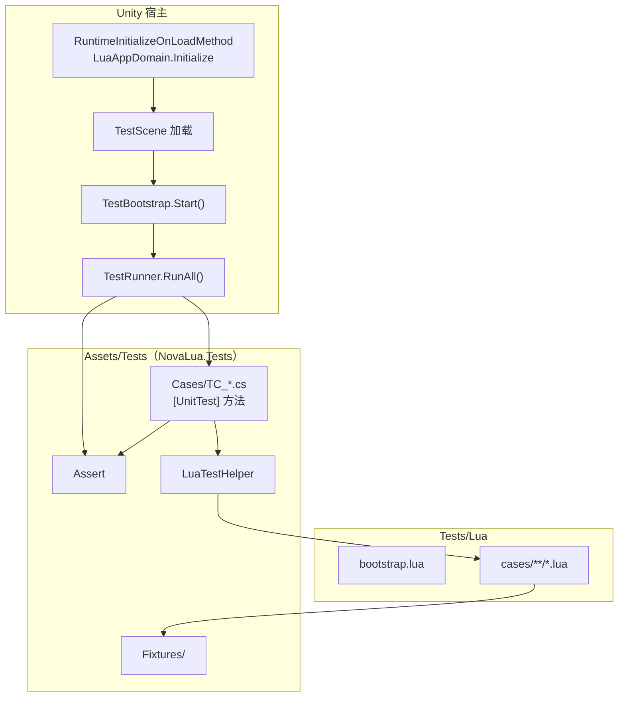

# NovaLua 测试框架设计

本文档描述 NovaLua **正确性测试**的目录布局、C# 自研 Runner、Lua 用例组织与执行方式。测试框架**不依赖 Unity Test Framework**，**不包含 benchmark**。

**相关文档：**

| 文档 | 内容 |
|------|------|
| `DESIGN_SPEC.md` | 双运行时（Mono / Il2Cpp）总体架构 |
| `TYPE_SYSTEM_SPEC.md` | 类型访问、泛型、数组、继承 |
| `METHOD_OVERLOAD_SPEC.md` | 方法重载 dispatch |
| `MARSHAL_SPEC.md` | 参数编组 |
| `FUNCTION_MARSHAL_SPEC.md` | Delegate、Lua 回调 |
| `DEV.md` | v1 功能清单与里程碑 |

**平台原则：** 同一套用例在 **Editor（Mono）** 与 **Player（Il2Cpp）** 下各运行一次；框架**不区分**具体实现，无 `skip` / `xfail` / `mono_only` 等运行时分支——任一后端失败即失败。

---

## 1. 设计目标

| 目标 | 说明 |
|------|------|
| **正确性** | 验证 Lua↔C# 互操作语义与各 spec 一致 |
| **双端一致** | Mono 与 Il2Cpp 共用同一程序集、同一 Lua 脚本、同一 pass/fail 标准 |
| **可回归** | 场景 Play 或 batchmode Player 一键跑全量 |
| **可定位** | 失败输出 `TypeName.MethodName` 与异常信息 |
| **实现无关** | Runner 只依赖 `LuaAppDomain` 等公开 API，不感知 Mono / Il2Cpp 分支 |

C# 测试基础设施对齐 [LeanCLR 测试 Common](https://github.com/focus-creative-games/hybridclr) 中的 `Assert`、`UnitTestAttribute`、`TestRunner`（反射扫描 + 逐方法 `Invoke`）模式。

---

## 2. 目录与程序集

测试资源分布在 **Package 文档** 与 **NovaLuaTest 工程** 两处：

```
NovaLuaTest/                          # Unity 工程根
├── Tests/                            # Lua 用例（非 Assets）
│   └── Lua/
│       ├── bootstrap.lua             # 公共 alias、前置设置
│       └── cases/                    # 按 spec 分子目录
│           ├── type_system/
│           ├── method_overload/
│           ├── marshal/
│           ├── function_marshal/
│           └── luainvoke/
│
├── Assets/
│   ├── Tests/                        # C# 测试程序集（独立 asmdef）
│   │   ├── NovaLua.Tests.asmdef
│   │   ├── Common/                   # 框架
│   │   ├── Fixtures/                 # 供 Lua 调用的 C# 类型
│   │   ├── Cases/                    # TC_* 测试类
│   │   └── TestBootstrap.cs          # 场景入口
│   ├── Scenes/
│   │   └── TestScene.unity           # 测试专用场景
│   └── Editor/
│       └── SyncTestsLuaToStreamingAssets.cs
│
Packages/com.code-philosophy.novalua/
└── Docs/
    └── TEST_FRAMEWORK.md             # 本文档
```

| 位置 | 内容 |
|------|------|
| `NovaLuaTest/Tests/Lua/` | Lua 测试脚本 |
| `Assets/Tests/` | 全部 C# 测试代码（**单一程序集** `NovaLua.Tests`） |
| `Packages/.../Docs/` | 设计规范（本文档） |

Fixture 类型、Runner、断言与用例类**同处** `NovaLua.Tests` 程序集；Lua 侧通过 `CSharp['NovaLua.Tests']` 访问 Fixture。

---

## 3. 总体架构



**三层：**

1. **Fixture 层**（C#，`Fixtures/`）：构造边界类型，供 Lua 或 C# 调用。
2. **用例层**（C# + Lua）：`[UnitTest]` 方法驱动；互操作场景由 Lua 脚本执行断言。
3. **Runner 层**（C#，`Common/TestRunner.cs`）：反射扫描、汇总、输出；场景 `Start` 后触发。

---

## 4. C# 框架（Common/）

### 4.1 `Assert.cs`

与 LeanCLR `Assert` 对齐，提供：

| API | 说明 |
|-----|------|
| `Fail` / `Fail(string)` | 显式失败 |
| `IsTrue` / `IsFalse` / `True` / `False` | 布尔断言 |
| `Null` / `NotNull` | 引用断言 |
| `Equal` | 重载：`int`、`long`、`float`、`double`、`string`、`bool`、`Type`、`char`、`T` 等 |
| `NotEqual` / `EqualAny` | 不等 / 任意对象相等 |
| `ExpectException<T>(Action)` | 期望抛出指定异常 |

失败时 `Debugger.Log` 并抛异常；Runner 捕获后记 `[FAIL]`。

### 4.2 标记属性

```csharp
[AttributeUsage(AttributeTargets.Method)]
public class UnitTestAttribute : Attribute { }

[AttributeUsage(AttributeTargets.Class | AttributeTargets.Method)]
public class IgnoreTestAttribute : Attribute { }
```

- `[UnitTest]`：标记测试方法；须为 `void`、无参数；实例或静态均可。
- `[IgnoreTest]`：跳过整个类或单个方法（用于临时禁用，**不**用于区分 Mono / Il2Cpp）。

### 4.3 `TestCaseBase.cs`

```csharp
public abstract class TestCaseBase { }
```

测试类可选继承，便于日后扩展 `[SetUp]` 等钩子；当前为空基类。

### 4.4 `TestRunner.cs`

逻辑对齐 LeanCLR `RunTests/Program.cs`：

1. 扫描目标程序集（至少 `NovaLua.Tests`）。
2. 跳过带 `[IgnoreTest]` 的类。
3. 收集带 `[UnitTest]` 且签名合法的方法。
4. 实例方法：`Activator.CreateInstance(type)`；失败记 `[FAIL]`。
5. `method.Invoke`；`TargetInvocationException` 取 `InnerException`。
6. 输出 `[PASS]` / `[FAIL]` / `[SUMMARY] total=…, passed=…, failed=…`。
7. 返回是否全部通过；batchmode Player 下 `failed > 0` 时 `Application.Quit(1)`。

**RunAll 开始前**调用 `LuaTestHelper.EnsureInitialized()`，保证 Lua 状态与 `bootstrap.lua` 已就绪。

### 4.5 `LuaTestHelper.cs`（NovaLua 专用）

仅依赖 `LuaAppDomain` 等公开 API，与 Mono / Il2Cpp 实现无关：

| API | 说明 |
|-----|------|
| `EnsureInitialized()` | 幂等初始化；加载 `novalualib`、`Tests/Lua/bootstrap.lua` |
| `RunModule(string module)` | 加载并执行 `Tests/Lua/{module}.lua` |
| `RunChunk(string lua)` | 执行 Lua 片段；Lua `error` → C# 异常 → 用例 fail |
| `Call<T>(…)` | C# 调 Lua（配合 `[LuaInvoke]` 探针） |

---

## 5. 场景入口与启动顺序

### 5.1 `TestBootstrap.cs`

挂载于 `TestScene` 中某 `GameObject`：

```csharp
public class TestBootstrap : MonoBehaviour
{
    void Start()
    {
        bool ok = TestRunner.RunAll();
#if !UNITY_EDITOR
        if (!ok)
            Application.Quit(1);
#endif
    }
}
```

### 5.2 启动顺序

```text
RuntimeInitializeOnLoadMethod (BeforeSceneLoad)
  → LuaAppDomain.Initialize(moduleLoader)

TestScene 加载完成
  → TestBootstrap.Start()
  → TestRunner.RunAll()
```

- **Demo 场景**（`SampleScene` + `Bootstrap.cs`）与测试场景分离，互不干扰。
- **CI / Il2Cpp 验证**：Build Settings 首场景设为 `TestScene`；Player 以 `-batchmode -nographics` 运行，检查进程退出码。

---

## 6. Lua 模块加载

| 环境 | 路径 |
|------|------|
| Editor | `{ProjectRoot}/Tests/Lua/{module}.lua` |
| Player | `StreamingAssets/Tests/Lua/{module}.lua.txt` |

`moduleLoader` 按模块名查找；路径规则与现有 `LuaScripts/` 一致（Editor 读源文件，Player 读 `.lua.txt`）。

构建前由 `SyncTestsLuaToStreamingAssets`（Editor 脚本）将 `Tests/Lua/**/*.lua` 同步到 StreamingAssets；模式同 `SyncLuaScriptsToStreamingAssets`。

### 6.1 `bootstrap.lua`

在 `EnsureInitialized` 中于用例前执行一次，例如：

```lua
-- 测试程序集 alias（Fixture 命名空间按实际调整）
CSharp.T = CSharp['NovaLua.Tests']
```

---

## 7. 用例编写模式

### 7.1 模式 A：纯 C#（LeanCLR 风格）

适用于 **C# 调 Lua（`[LuaInvoke]`）** 或纯 C# 可验证逻辑：

```csharp
public class TC_LuaInvoke : TestCaseBase
{
    [LuaInvoke("test_luainvoke", "add")]
    static extern int Add(int a, int b);

    [UnitTest]
    public void Add_returns_sum()
    {
        Assert.Equal(30, Add(10, 20));
    }
}
```

### 7.2 模式 B：C# 驱动 + Lua 脚本（互操作主路径）

```csharp
public class TC_StaticCall : TestCaseBase
{
    [UnitTest]
    public void Demo_Add()
    {
        LuaTestHelper.RunModule("cases/type_system/static_call");
    }
}
```

`Tests/Lua/cases/type_system/static_call.lua`：

```lua
local Demo = CSharp.T.Fixtures.OverloadDemo
assert(Demo.Add(3, 5) == 8)
```

Lua `assert` / `error` 失败由 `LuaTestHelper` 转为 C# 异常，Runner 记 `[FAIL]`。  
亦可在 Lua 末尾 `return value`，由 C# `Assert.Equal` 断言。

### 7.3 模式 C：C# 内嵌 Lua 片段

适用于短小场景：

```csharp
[UnitTest]
public void Quick_check()
{
    LuaTestHelper.RunChunk([[
        assert(CSharp.T.Fixtures.BasicTypes.Pi > 3)
    ]]);
}
```

**约定：** 互操作相关优先 **模式 B**；`LuaInvoke` 反向调用优先 **模式 A**。

---

## 8. Fixtures（`Assets/Tests/Fixtures/`）

public 类型，成员 public，供 Lua 与 C# 共用。按 spec 分模块：

| Fixture 类 | 对应文档 |
|------------|----------|
| `BasicTypes` | `MARSHAL_SPEC.md` 基元 |
| `StructBox` | `STRUCT_MARSHAL_SPEC.md` |
| `ClassHierarchy` | `TYPE_SYSTEM_SPEC.md` §5 继承 |
| `NamespacedTypes` / `MyGame.UI.Panel` | `TYPE_SYSTEM_SPEC.md` §2.2 |
| `GenericFixtures` | `TYPE_SYSTEM_SPEC.md` §2.5–§2.6 |
| `OverloadDemo` | `METHOD_OVERLOAD_SPEC.md` |
| `ArrayFixtures` | `TYPE_SYSTEM_SPEC.md` §7、`LIB_SPEC.md` §6 |
| `DelegateFixtures` | `FUNCTION_MARSHAL_SPEC.md` |
| `PropertyFixtures` / `EventFixtures` | `TYPE_SYSTEM_SPEC.md` §4 |

约定：

- 类型带**可观测状态**（如 `Counter`、`LastCallArgs`），便于断言。
- 用例间通过实例化新对象或显式 Reset 避免顺序依赖。
- Fixture 程序集走 NovaLua Codegen / Weaver，保证 Il2Cpp 桥接表完整。

---

## 9. 用例与 spec 映射

### 9.1 C# 用例（`Assets/Tests/Cases/`）

```
TC_TypeSystem_Path.cs
TC_TypeSystem_Generic.cs
TC_TypeSystem_Array.cs
TC_TypeSystem_Inheritance.cs
TC_MethodOverload_Dispatch.cs
TC_Marshal_Primitives.cs
TC_Marshal_Struct.cs
TC_FunctionMarshal_Delegate.cs
TC_LuaInvoke_CallLua.cs
```

类名前缀 `TC_`；每个 `[UnitTest]` 方法为最小执行单元。

### 9.2 Lua 脚本（`Tests/Lua/cases/`）

与上表对应的 Lua 模块，供模式 B 调用：

```
type_system/
method_overload/
marshal/
function_marshal/
luainvoke/
```

新增功能时：**先写用例、再实现**；未实现则 fail，驱动开发完成。

---

## 10. 执行方式

| 场景 | 操作 |
|------|------|
| 日常开发（Mono） | 打开 `TestScene` → Play → Console 查看 `[SUMMARY]` |
| Il2Cpp 本地验证 | Build Player（`TestScene` 为首场景）→ 运行 |
| CI（可选） | Player `-batchmode -nographics` → 检查 exit code |

Runner 可在 `[SUMMARY]` 旁**只读**输出当前后端（Editor / Player）以便调试，**不参与** pass/fail 判定。

---

## 11. 与 Demo 工程的关系

| 现有 | 测试框架 |
|------|----------|
| `Assets/Bootstrap.cs` + `SampleScene` | 保留为 smoke demo |
| `LuaScripts/app.lua` | 不纳入 Runner |
| `Assets/Demo.cs` | 可逐步迁入 `Fixtures/`，或保留作最小示例 |

`NovaLua.Tests.asmdef` 引用 NovaLua 运行时程序集与 `UnityEngine`；**不引用** Unity Test Framework。

---

## 12. 实施分期

| 阶段 | 内容 |
|------|------|
| **P0** | `Common/*`、`TestRunner`、`TestBootstrap`、`TestScene`；1 个纯 C# 用例 + 1 个 Lua 用例跑通 |
| **P1** | `Fixtures` 基础集、`bootstrap.lua`、`SyncTestsLuaToStreamingAssets` |
| **P2** | 按 `DEV.md` v1 清单补全 `Cases/` 与 `Tests/Lua/cases/`，对齐各 spec |

---

## 13. 实现清单（参考）

- [x] `NovaLua.Tests.asmdef` 与程序集引用
- [x] `Common/Assert.cs`、`UnitTestAttribute`、`IgnoreTestAttribute`、`TestCaseBase`
- [x] `Common/TestRunner.cs`（反射扫描 + 汇总）
- [x] `Common/LuaTestHelper.cs`
- [x] `TestBootstrap.cs` + `TestScene.unity`
- [x] `Tests/Lua/bootstrap.lua` + `cases/` 目录占位
- [x] `SyncTestsLuaToStreamingAssets.cs`
- [ ] `Fixtures/` 初始类型集
- [ ] `Cases/` 与 `DEV.md` v1 功能对齐
