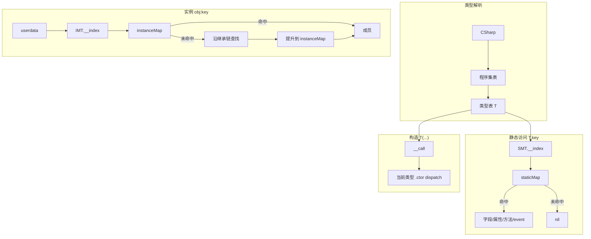

# NovaLua 类型系统与元表规范

本文档描述 Lua 侧 **访问 C# 类型、成员与元表（metatable）** 的完整设计，适用于 **Il2Cpp（Player）** 与 **Mono（Editor）**。

**相关文档：**

| 文档 | 内容 |
|------|------|
| `LIB_SPEC.md` | `novalua` 标准库 Lua API |
| `METHOD_OVERLOAD_SPEC.md` | 方法重载 dispatch、签名、`get_method` |
| `MARSHAL_SPEC.md` | 参数编组总览 |
| `STRUCT_MARSHAL_SPEC.md` | struct 传递 |
| `CLASS_MARSHAL_SPEC.md` | class / 引用类型传递 |
| `DESIGN_SPEC.md` | 总体目标与双运行时架构 |

**平台原则：** Il2Cpp 侧重零 GC 与直接内存/`methodPointer` 访问；Mono 可基于反射实现，但 **Lua 可见语义必须与 Il2Cpp 一致**。

---

## 1. 设计目标

| 目标 | 说明 |
|------|------|
| 统一入口 | 所有普通类型经 `CSharp` 根表懒加载访问 |
| 语义贴近 C# | `Type.Static()`、`obj:Instance()`、构造 `Type()` 与 C# 一致 |
| 静实例隔离 | 静态成员与实例成员使用**完全独立**的元数据表，禁止混用 |
| 仅 public | Lua 仅可访问 `public` 成员 |
| 可优化 | Il2Cpp 字段/无参属性走 `__index` / `__newindex` 快速路径 |

---

## 2. 类型命名与解析

### 2.1 `CSharp` 根表

```
CSharp                          -- 全局表，__index → 懒加载程序集
  └─ {assemblyName}             -- 程序集表，__index → 懒加载类型
       └─ {typeFullName}         -- 类型表（见 §3）
```

**程序集名**为程序集简单名（不含 `.dll`），例如 `Assembly-CSharp`、`mscorlib`。

**简写别名**（可选，由 Lua 或 `globals.lua` 定义，非框架强制）：

```lua
CSharp.AC = CSharp['Assembly-CSharp']   -- 便于 CSharp.AC.Demo
```

### 2.2 类型访问语法

程序集表上的类型键为 **完整类型名** `typeFullName`（含命名空间，见 §2.3）。访问分两类：

#### 无命名空间的类型（全局命名空间）

当类型**不在任何 namespace 内**，且 `assemblyName` 与 `TypeName` 均为合法 Lua 标识符时，可用点号：

```lua
CSharp.AC.Demo                    -- OK：Demo 在全局命名空间，AC 为程序集别名
CSharp['Assembly-CSharp'].Demo  -- 等价括号写法
```

#### 含命名空间的类型（强制括号）

当类型带有 **namespace** 时，**禁止**将命名空间拆成多级点号访问：

```lua
-- 禁止（解析错误或未定义行为）：
CSharp.AC.MyGame.UI.Panel

-- 必须：整段 typeFullName 作为程序集表的一个键
CSharp.AC['MyGame.UI.Panel']
CSharp['Assembly-CSharp']['MyGame.UI.Panel']
```

规则：**namespace 与类型名中的 `.` 属于 `typeFullName` 字符串本身**，不是 Lua 表路径分隔符。

#### 程序集名含特殊字符

程序集名含 `-` 等非法标识符字符时，程序集级访问须用括号，类型仍按上文规则：

```lua
CSharp['Assembly-CSharp']['MyGame.UI.Panel']   -- 含 namespace
CSharp['Assembly-CSharp'].Demo                 -- 无 namespace 的全局类型
```

**合法 Lua 标识符**：`[A-Za-z_][A-Za-z0-9_]*`。类型名或程序集名含 `-`、`+`、空格、泛型 `` ` `` 等时，对应段**必须**用 `['...']`。

| 场景 | 写法 |
|------|------|
| 无 namespace + 合法程序集/类型名 | `CSharp.{assembly}.{TypeName}` |
| **有 namespace** | `CSharp.{assembly}['{Namespace}.{TypeName}']`（**必须**） |
| 含特殊字符 | 对应用括号键 `['...']` |

### 2.3 命名空间与嵌套类型

- **命名空间**在 `typeFullName` 中以 `.` 连接：`MyGame.UI.Panel` 表示 namespace `MyGame.UI` 下的类 `Panel`。
- 访问时整段作为程序集表键（§2.2），**不得**写成 `CSharp.asm.MyGame.UI.Panel`。
- **嵌套类型**在 `typeFullName` 中继续用 `.` 连接外层与内层类名：

```
TopClass.NestedClass     -- 对应 C# TopClass 内的 NestedClass
```

> **实现注记：** CLR 反射/IL 元数据中嵌套类型常用 `TopClass+NestedClass`（`+` 分隔）。解析时由 native 将 Lua 的 `.` 形式映射到 Il2Cpp/反射全名；类型表 `__fullname` 字段统一存 Lua 规范名（`.` 形式）。

### 2.4 泛型类型

```lua
local List_int = novalua.make_generic_type(
    CSharp.mscorlib['System.Collections.Generic.List'],
    novalua.types.int32
)
```

- `generic_base_type`：未闭合的泛型定义类型表（通过 `CSharp[...]` 获得）。
- 其余参数：类型实参（`novalua.types.*` 或 `novalua.typeof(...)`）。
- 返回**新的类型表**，与 `make_generic_type` 的实参一一对应；同一闭合泛型多次调用应返回**同一**类型表（intern）。

### 2.5 数组类型

#### 单维向量数组（szarray）

```lua
local int_arr_type = novalua.make_szarray_type(novalua.types.int32)
-- 语义等价于 C# int[]
```

#### 多维数组（mdarray）

```lua
local md_type = novalua.make_mdarray_type(novalua.types.int32, 2)  -- int[,]
```

`rank` 为维度数（≥ 1）。mdarray 与 szarray 为不同类型。

### 2.6 `novalua.typeof`

```lua
local t = novalua.typeof(CSharp.AC.Demo)
```

返回该类型对应的 **System.Type 等价物**（Mono 为真实 `System.Type`；Il2Cpp 为携带 `Il2CppClass*` 的类型描述对象）。供 `signature`、`make_*_type` 等 API 使用。

### 2.7 `novalua.types`

记录了c#常见类型的全名字符串。如 `novalua.types.int32`的值为`System.Int32`

---

## 3. 类型表与元表结构

### 3.1 类型表（静态门面）

每个 C# 类型对应一张 **类型表** `T`（Lua table），带 **静态元表** `SMT`：

```
T  (类型表，Lua 可见静态成员 + 元数据字段)
├─ __assembly      : string
├─ __fullname      : string
├─ __name          : string
├─ __instance_mt   : table     → 实例元表 IMT（§3.2）
├─ __klass         : lightuserdata (Il2Cpp) / typeId (Mono)  [实现用]
├─ StaticField     : 快速字段访问或 closure
├─ StaticMethod    : closure / dispatch closure
├─ static_event    : event 表 { get, set, fire }
└─ ...

SMT (__index / __newindex on T)
  → 查 staticMap：字段 / 无参属性 / 方法 / 事件
  → 未命中：返回 nil（§5.1，不向上查父类）
```

**`__call`**（在 `SMT` 或 `T` 上）：调用实例构造函数 `T(...)`。无 public 实例构造时调用报错。

**通过类型表仅可访问静态成员**：静态字段、静态属性、静态方法、静态 event。  
**唯一例外**：`__call` 创建实例。

### 3.2 实例元表 `__instance_mt`

实例 userdata 的元表 `IMT` 与 `SMT` **完全独立**：

```
IMT
├─ __index      → 查 instanceMap；未命中则继承解析 + 提升（§5.2）
├─ __newindex   → 实例字段/属性/event 赋值
├─ __gc         → 释放 ObjectRegistry 跟踪
└─ __type       : → 指回类型表 T（互查引用，§3.3）

instance userdata
  metatable = IMT
  payload   = Il2CppObject* / GCHandle
```

**禁止**：通过实例 userdata 以 `__index` **隐式**访问静态成员（应使用类型表）。`novalua.get_method(obj, ..., is_static=true)` 等**显式 API** 除外（见 `METHOD_OVERLOAD_SPEC.md`）。

### 3.3 静实例互查引用

| 引用 | 用途 |
|------|------|
| `T.__instance_mt` → `IMT` | 构造实例时挂接元表 |
| `IMT.__type` → `T` | 从实例反查类型、`typeof`、注册方法 |
| `TypeBinding`（native） | 同时持有 `staticMap` 与 `instanceMap`，供 `__index` 共享 |

互查在类型**首次绑定**时建立，之后不变。

### 3.4 延迟初始化

静态绑定（`SMT` + `staticMap`）与实例绑定（`IMT` + `instanceMap`）均在**该类型第一次被访问**时完整构建（`EnsureBinding`），而非启动时全量注册。

构建内容（Codegen 或反射扫描，**仅 public**）：

- 字段、无参/有参属性、方法、event、构造函数元数据
- 继承的 **实例** 成员索引（见 §5）
- 继承的 **静态** 成员**扁平复制**到派生类 `staticMap`（见 §5.1）

---

## 4. 成员在 Lua 侧的暴露规则

### 4.1 可见性

仅 `public` 成员进入 `staticMap` / `instanceMap`。`internal` / `protected` / `private` 对 Lua 不可见。

### 4.2 字段

| 访问 | 实例 | 静态 |
|------|------|------|
| 读 | `obj.field` | `Type.field` |
| 写 | `obj.field = v` | `Type.field = v` |

只读字段（`readonly`、无 setter 的 init-only）赋值时报错。

### 4.3 属性

| 类型 | Lua 访问 |
|------|----------|
| 无参属性 | `obj.prop` / `Type.prop`（Il2Cpp 可走快速路径，§7） |
| 有参属性 | **仅** `get_PropName(args)` / `set_PropName(args)` 方法形式；不模拟 `obj:Prop(a)` |

索引器同理：`get_Item(i)` / `set_Item(i, v)`。

### 4.4 方法

见 `METHOD_OVERLOAD_SPEC.md`：单重重载直接 closure；多重重载 dispatch；`[LuaAlias]` / `get_method` / `register_method`。

### 4.5 事件

暴露为表：

```lua
Type.SomeEvent = { get = fn_add, set = fn_remove, fire = fn_raise }  -- 视元数据而定
```

- `get` → `add` 处理器
- `set` → `remove` 处理器（命名与 C# event 语义对齐，非 C# property 的 get/set）
- `fire` → 若有 `raise` 方法则暴露

实例 event 同理，调用时需传入 `self`。

### 4.6 构造函数

- 仅通过类型表 `Type(...)` / `__call` 调用。
- **不**在继承链上查找基类构造；仅使用**当前类型**声明的 public 实例构造函数。
- 多构造函数：与实例方法相同，使用 **dispatch**（`METHOD_OVERLOAD_SPEC.md` §3）。

---

## 5. 继承

### 5.1 静态成员：无运行时父类查找

`SMT.__index` / `__newindex` 在 `staticMap` 未命中时 **不**递归查找父类。

为保持与 C#「可通过派生类型名访问继承的 static 成员」一致，在 **Bind 期**将基类 public 静态成员**扁平注册**到派生类型的 `staticMap`（派生类同名成员覆盖基类）。因此运行时仍 O(1)，且无需向上遍历。

**`new` / `hide`：** 派生类声明的 `new static` 成员覆盖扁平表中的基类项。

### 5.2 实例成员：继承查找 + 提升缓存

`IMT.__index` / `__newindex` 流程：

```
1. 查当前类型 instanceMap
2. 命中 → 返回
3. 未命中 → 沿继承链向上查找 public 成员（最近优先：子类已声明则不会落到父类同名）
4. 找到 → 将条目**复制/提升**到当前类型 instanceMap（键 → MetaInfo）
5. 下次同键访问 O(1)
6. 全链未命中 → __index 返回 nil；__newindex 报错
```

**提升（promotion）** 仅缓存**解析结果**，不改变 C# 虚调用语义；虚方法仍通过生成的 bridge 走 `methodPointer` 虚派发。

**构造函数**不参与继承查找（§4.6）。

### 5.3 方法与 dispatch 的继承

若某方法名在继承树上存在多个 public 重载（含父类），则该名绑定 **dispatch closure**（见 `METHOD_OVERLOAD_SPEC.md`）：

1. 先在**当前类型**声明的重载中按参数匹配；
2. 若无匹配，再递归父类（及更上级）的**同域**（static / instance 分开）重载列表；
3. 顺序：子类声明优先，再按 `METHOD_OVERLOAD_SPEC.md` 的候选顺序。

别名（`[LuaAlias]`）不参与 dispatch，为独立键。

---

## 6. 泛型方法

仅针对**方法自身带泛型参数**的情形，例如 `int Foo<T>(T a)`。  
**泛型类上的普通方法**（如 `List<int>.Add(int)`）已闭合，**不**走本节。

### 6.1 调用约定

```lua
local inst = novalua.make_generic_inst(novalua.types.int32)
Type.Foo(inst, value)   -- 第一实参必须是 generic_inst
```

`make_generic_inst` 校验类型参数个数与约束（Il2Cpp 开销大，须校验）。

### 6.2 `inflatedMap` 缓存

每个泛型方法维护：

```
genericMethodId × generic_inst fingerprint → inflated MethodInfo / bridge closure
```

首次 `generic_inst` 组合完成校验与 inflation 后写入；后续 O(1) 复用。  
**禁止**每次调用重复做完整约束检查。

---

## 7. 数组：创建与 `__len`

### 7.1 创建 szarray

```lua
local arr1 = novalua.new_szarray_by_element_type(novalua.types.int32, 10)
local arr2 = novalua.new_szarray_by_szarray_type(int_arr_type, 10)
```

第二参数为长度（≥ 0）。元素初始化为 `default(T)`。

### 7.2 创建 mdarray

```lua
-- 方式 A：已知 mdarray 类型
local arr = novalua.new_mdarray_by_mdarray_type(md_type, lowbounds, sizes)

-- 方式 B：由元素类型 + 维度规格构造
local arr = novalua.new_mdarray_by_spec(novalua.types.int32, lowbounds, sizes)
```

| 参数 | 说明 |
|------|------|
| `lowbounds` | 长度为 `rank` 的表，每维下界 |
| `sizes` | 长度为 `rank` 的表，每维元素个数 |

### 7.3 szarray 的 `#`

szarray 实例 userdata 实现 `__len`：

```lua
local n = #arr   -- 等价于 C# arr.Length
```

mdarray 无单一 `Length` 语义，**不**实现 `__len`；通过 `GetLength(d)` 或专用 API 访问。

### 7.4 szarray 与 Lua 互转

由 `novalua` 标准库提供（详见 `LIB_SPEC.md` §6.3）：

| API | 说明 |
|-----|------|
| `novalua.to_bytes(arr)` | 基元 szarray → 二进制 Lua `string`（仅 blittable 基元） |
| `novalua.to_table(arr)` | 任意元素类型 szarray → 等长 Lua 表（`t[i]` ↔ `arr[i-1]`） |

### 7.5 数组类型表

数组类型表与普通类型表结构相同（静态门面 + 实例元表）。实例为数组对象 userdata，元素访问/赋值规则见 `CLASS_MARSHAL_SPEC.md`。

---

## 8. Il2Cpp 元表快速路径

以下优化**不改变 Lua 语义**；Mono 可走反射慢路径。

### 8.1 字段

在 `__index` / `__newindex` 中根据 Codegen 预计算的 **偏移** 直接读写：

- 静态字段：`staticAddress`（类型数据段指针 + offset）
- 实例字段：`(uint8_t*)object + instanceOffset`

为常见基元（`int`、`bool`、`float`、`double`、`IntPtr` 等）和引用类型字段生成专用 `getter` / `setter` 函数指针，存入 `MetaInfo.field`。

### 8.2 无参属性

无参 property 若 getter/setter 可内联为字段等价或单跳 `methodPointer`，在 `__index` / `__newindex` 快速路径处理；否则退化为 `getterRef` / `setterRef` closure 调用。

### 8.3 有参属性

仅 `get_XXX` / `set_XXX` closure，不走属性名直接访问。

### 8.4 方法

通过 `MethodInfo::methodPointer` + 签名桥接调用，不经 C# 包装。

---

## 9. 总体访问流程



---

## 10. 特殊类型（概要）

| 类型 | 说明 |
|------|------|
| 接口 | 可解析类型表；不可 `__call` 构造（除非默认接口方法场景，不支持） |
| 抽象类 | 若有 protected 构造对 Lua 不可见；仅 public 构造可 `__call` |
| 静态类 | 仅静态成员，无 `__call` |
| 枚举 | 作为类型表；值见 `MARSHAL_SPEC.md` |
| 委托 | 类型表 + `__call` 调用链，见 `CLASS_MARSHAL_SPEC.md` |
| 值类型 struct | 类型表 + 实例 userdata；传递见 `STRUCT_MARSHAL_SPEC.md` |

---

## 11. Mono / Il2Cpp 一致性

| 项 | 要求 |
|----|------|
| 类型命名与 `CSharp` 路径 | 一致 |
| 静实例隔离 | 一致 |
| public 可见性 | 一致 |
| 继承查找与提升语义 | 一致 |
| 构造、dispatch、泛型方法 | 一致 |
| 数组创建与 `#` | 一致 |
| 错误消息 | 一致或等价 |
| 性能 | Il2Cpp 必须满足 §8；Mono 允许反射 |

---

## 12. 示例

```lua
CSharp.AC = CSharp['Assembly-CSharp']

-- 无 namespace 的全局类型：点号
local sum = CSharp.AC.Demo.Add(3, 5)
local demo = CSharp.AC.Demo()

-- 含 namespace 的类型：必须括号
local panelType = CSharp.AC['MyGame.UI.Panel']
local panel = panelType()
demo:SetX(10)
print(demo:GetX())

-- 泛型
local ListInt = novalua.make_generic_type(
    CSharp.mscorlib['System.Collections.Generic.List'],
    novalua.types.int32
)
local list = ListInt()

-- 数组
local IntArray = novalua.make_szarray_type(novalua.types.int32)
local arr = novalua.new_szarray_by_szarray_type(IntArray, 4)
print(#arr)
local bytes = novalua.to_bytes(arr)
local t = novalua.to_table(arr)

-- 显式重载（见 METHOD_OVERLOAD_SPEC.md）
local sig = novalua.signature(novalua.types.int32)
local run_i32 = novalua.get_method(demo, "Run", sig, false)
run_i32(demo, 20)
```

---

## 13. 实现清单（参考）

- [ ] `CSharp` 根表 + 程序集/类型懒加载
- [ ] 程序集 `__index`：无 namespace 类型支持点号；**有 namespace 类型仅接受整段 `typeFullName` 括号键**
- [ ] 类型表元数据字段 `__assembly` / `__fullname` / `__name` / `__instance_mt`
- [ ] `staticMap` 与 `instanceMap` 双表 + `SMT` / `IMT` 分离
- [ ] Bind 期扁平注册继承的 static 成员
- [ ] 实例 `__index` 继承查找 + promotion
- [ ] 构造 `__call`（无继承查找）+ overload dispatch
- [ ] `make_generic_type` / `make_szarray_type` / `make_mdarray_type`
- [ ] `new_szarray_*` / `new_mdarray_*`
- [ ] szarray `__len`
- [ ] 泛型方法 `make_generic_inst` + `inflatedMap`
- [ ] 嵌套类型 `.` ↔ CLR `+` 映射
- [ ] Il2Cpp 字段/无参属性快速路径（§8）
- [ ] Mono 语义对齐
